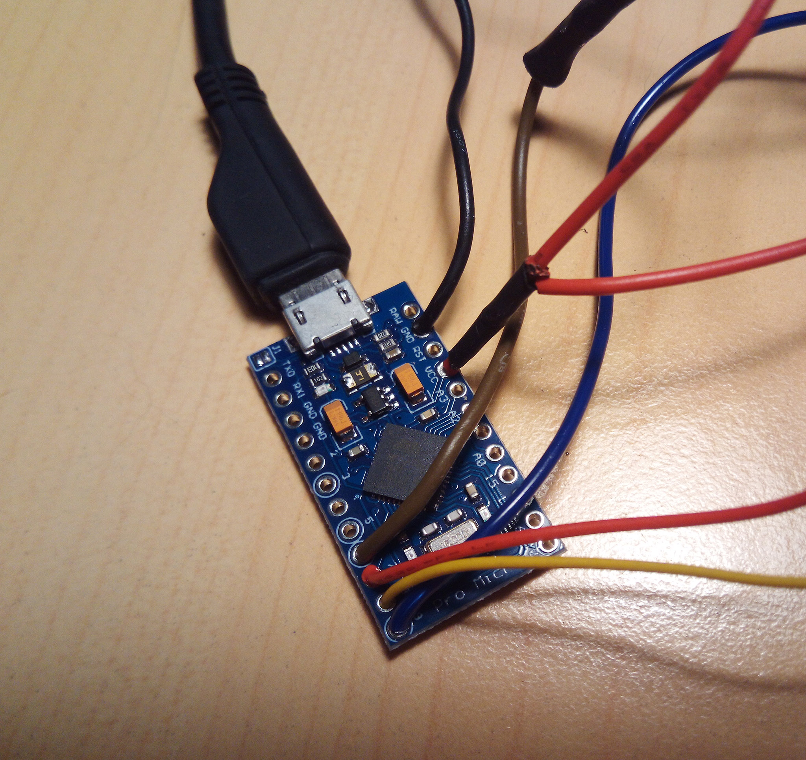

# PS2ToJoystick

After trying to connect my old [EMS PS2 to PC adapter](http://www.hkems.com/product/ps2/ps2-usb2.htm) in Windows 10 without success, because there are no drivers available for Windows 10 x64; and the provided driver from Microsoft doesn't show the controller, I build this small PS2 to PC adapter, using an **arduino micro**, a **PS2 female connector** and some wire. And here you are!, **PS2ToJoystick** !.

</img>

## Table Of Contents

1. [Project Features](#project-features)
2. [Part List](#part-list)
3. [Software](#software)
    1. [Arduino Setup](#arduino-setup)
    2. [Testing](#testing)
4. [Electronics](#electronics)
    1. [Wiring](#wiring)
5. [Box Enclosure](#box-enclosure)
6. [X360 Controller](#x360-controller)

## Project Features

This project provides:

1. The hardware diagram to connect the PS2 connector to the arduino micro.
2. The software to map the PS2 Dualshock 2 gaming pad buttons and axis, to PC Joystick buttons.
3. The STL to 3D print a simple box to enclosure all.
4. The documentation to map the excellect [X360ce driver](https://github.com/x360ce/x360ce/releases) so the arduino is shown as an X360 PC Controller.

**NOTE**: Rumble (aka vibration) is not supported.

## Part List

1. Arduino Pro Micro clone (**ATmega32U4**) from [amazon](https://www.amazon.es/gp/product/B01MTU9GOB/.ref=ppx_yo_dt_b_asin_title_o04_s00?ie=UTF8&psc=1)
2. A female PS2 Dualshock 2 connector. I get one unironing it from the old EMS PS2 to PC Adapter.
3. Some wire.
4. A 3D Printer if you want to print the case.

## Software

The concept is very simple: map the PS2 Dualshock 2 buttons to an HID compatible device (joystick) so windows handles it with the standard driver. Arduino Leonardo (Micro) supports USB impersonation, so we can configure it as a Joystick, so problem solved.

My work is based on [this article](https://www.instructables.com/id/PS2-Wire-Controller-and-Arduino-control-LEDs/) and the excellect library created by [Bill Porter](http://www.billporter.info/2010/06/05/playstation-2-controller-arduino-library-v1-0/): [PS2X_lib](https://github.com/madsci1016/Arduino-PS2X/tree/master/PS2X_lib). A deep work on button protocol handling can be found [here](https://store.curiousinventor.com/guides/PS2). We need also the [Joystick Library](https://github.com/MHeironimus/ArduinoJoystickLibrary).

### Arduino Setup

</img>

1. Download [PS2X_lib](https://github.com/madsci1016/Arduino-PS2X/tree/master/PS2X_lib) and install it in arduino libraries folder.
2. Download [ArduinoJoystickLibrary](https://github.com/MHeironimus/ArduinoJoystickLibrary) and install it in arduino libraries folder.
3. The Arduino Pro Micro selected uses an **ATmega32U4** microprocessor, so we have to choose in the board list
**Arduino Leonardo**. 
4. Select the USB port
5. Flash the `ps2joystick/ps2joystick.ino` sketch as usual.

### Testing

Just connect your Arduino Micro Clone in the PC with Windows 10, and open `Game Controllers`, you should have something like the following window:

</img>

Then click ond Properties, and check the buttons:

</img>

* Left analog stick is mapped to X/Y Axis.
* Right analog stick is mapped to X/Y Rotation.


Button Mapping (on X360ce, we have to add '1' to the ID, see below)


|Name            |Id      |
|----------------|-------:|
|JOY_CROSS       |0       |
|JOY_CIRCLE      |1       |
|JOY_SQUARE      |2       |
|JOY_TRIANGLE    |3       |
|JOY_L1          |4       |
|JOY_L2          |5       |
|JOY_L3          |6       |
|JOY_R1          |7       |
|JOY_R2          |8       |
|JOY_R3          |9       |
|JOY_SELECT      |10      |
|JOY_START       |11      |
|JOY_PAD_UP      |12      |
|JOY_PAD_DOWN    |13      |
|JOY_PAD_LEFT    |14      |
|JOY_PAD_RIGHT   |15      |

So you have a functional PS2 Dualshock 2 gaming pad working on your Windows 10, as a Joystick!. If you want to play modern games with the pad, you should read the section below [X360 Controller](#x360-controller)

## Electronics

Easy electronics. Just solder some wires (use pins if you want) following the next diagram

### Wiring

Female Socket (the opposite to DualShock 2 connector) (looking from FRONT)
```
\-------------------------/
 \ 1 2 3   4 5 6   7 8 9 /
  \---------------------/
```

|Dualshock PIN   |color   |function |                      arduino PIN|
|----------------|--------|---------|--------------------------------:|
|1               |brown   |DATA     | (with pullup resistor 4.7KOhm) 6|
|2               |orange  |COMMAND  |                                7|
|3               |grey    |VIBRATION|                                 |
|4               |black   |GROUND   |                              GND|
|5               |red     |VCC      |                              VCC|
|6               |yellow  |SELECT   |                                8|
|7               |blue    |CLOCK    |                                9|
|8               |white   |UNKNOWN  |                                 |
|9               |green   |ACK      |                                 |

</img>
</img>

On **DualShock 2 PIN 1**, we need a pull up Resistor. This is the wiring diagram for that PIN:

```
                                ARDUINO PIN 6
                                    |
                                    |
 VCC -------------[ R 4.7KOhm ]-----+
                                    |
                                    |
                                DUALSHOCK 2 PIN 1 (BROWN)
```

In this picture, you can see the pull up resistor on the left side.
</img>


## Box Enclosure

I provide a simple STL `3dprint/box.stl` file for the box enclosure, if you want to print it. The STL are ready positioned in the "right" way to be printed, so just print them as is. I use a Ender-3 Pro with Marlin Firwmare, and PLA, and get good results. It tooks about **2 hours 30 minutes** to print. I use CURA for slicing with the following major configuration settings:

|Variable                                        |Value    |
|------------------------------------------------|--------:|
|Layer Height| 0.21|
|Initial Layer Height| 0.32|
|Wall Thickness| 0.88|
|Wall Line count| 3|
|Top/Bottom Thickness| 0.92|
|top Thickness| 0.92|
|Top Layers| 5|
|bottom Thickness| 0.92|
|bottom Layers| 5|
|Top/Bottom pattern| lines|
|Horizontal expansion| 0|
|Infill density| 60%|
|Infill pattern| grid|
|Printing temperature| 190|
|Printing temperature initial layer| 195|
|Build plate temperature| 55|
|Build plate temperature initial layer| 75|
|Initial Layer flow| 100|
|Enable retraction| Checked|
|Retraction Distance| 6.5|
|Retraction Speed| 50|
|Print Speed| 50|
|Infill Speed| 50|
|Wall speed| 25|
|Top/Bottom speed| 25|
|Travel Speed| 150|
|Initial Layer Print Speed| 15|
|Initial Layer Travel Speed| 30|
|Combing mode| All|
|Avoid Supports when travelling| checked|
|Z Hop when retracted| checked|
|Enable Print cooling| checked|
|Fan Speed| 100|
|Initial Fan Speed| 0|
|Regular Fan Speed at Height| 0.72|
|Regular Fan Speed at Layer| 3|
|Generate Support| Checked|
|Support Placement| Everywhere|
|Support Overhang Angle| 47|
|Support Pattern| ZigZag|
|Support Density| 20|
|Support Z Distance| 0.2|
|Suport X/Y Distance| 0.88|
|User Towers| unchecked|
|Build plate adhesion type| None|
|Surface mode| Normal|
|Enable Bridge Settings| Checked|

</img>
</img>
</img>

## X360 Controller

[X360ce](https://github.com/x360ce/x360ce) is a XBox 360 Contoller emulator: 

>"Xbox 360 Controller Emulator" allows your controller (gamepad, joystick, wheel, etc.) 
>to function as an Xbox 360 controller. For example, it lets you play games such 
>as "Grand Theft Auto" (GTA) or "Mafia II" using a Logitech Wheel.

We need to use the NEW version [alpha](https://github.com/x360ce/x360ce/releases/tag/4.10.0.0), no the stable one (they are very different) so [get the driver](https://github.com/x360ce/x360ce/releases/download/4.10.0.0/x360ce.zip) and install it.

I use this [excellect tutorial](https://steamcommunity.com/sharedfiles/filedetails/?id=875960196) to figure how to install it (this tutorial is for the old version). But the new version of X360ce requires a [sighly modified installation steps](https://github.com/x360ce/x360ce/wiki/Beta-Testing):

From their website:

>There is no need to place x360ce.exe inside the game folder. You can keep single copy of executable at one place (for >example: C:\Program Files\x360ce\x360ce.exe), because same virtual "Xbox 360 Controller" will be visible for all games >in Windows.


>Do not close "Xbox 360 Controller Emulator" during the game, just minimize it in order to reduce CPU use.


>Make sure your game is set to use XInput Devices. For example, in "Tom Clancy's Ghost Recon Wildlands" you have to set >OPTIONS -> CONTROLLER -> ENABLE CONTROLLER: ONLY GAMEPADS

### Install instructions (from their website):

1. Download latest Xbox 360 Controller Emulator (same file for 32-bit and 64-bit Windows) from: x360ce [4.x.x.x - Releases Page](https://github.com/x360ce/x360ce/releases)
2. Extract ZIP file and launch `x360ce.exe` file.
3. Enabling Virtual Drivers:
    1. `[Issues]` tab will start blinking it Virtual Drivers are missing.
    2. Press `[Issues]` tab and hit `[Install]` button to install Virtual Controller Drivers.
4. Mapping DirectInput Device:
    1. Connect your DirectInput Device to PC
    2. Select `[Controller 1]` tab and press `[Add..]` button.
    3. Select controller you want to map and press `[OK]` button.
    4. Click `"[x] Enable 1 Mapped Device"` checkbox inside `[Controller 1]` tab.
5. Configuring Mapping:
    1. Map buttons and axis by clicking on dropdowns, selecting `[Record]` and pressing on button or moving axis. 
    2. Hit `[Save]` button (at top right corner of application) when done.

6. Minimize `"Xbox 360 Controller Emulator"` in order to reduce CPU use. Note: Grey controller icon will be visible in tray.
7. Launch the game and see how it works.

#### Button Mappings for PS2 To Joystick in X360ce

</img>
